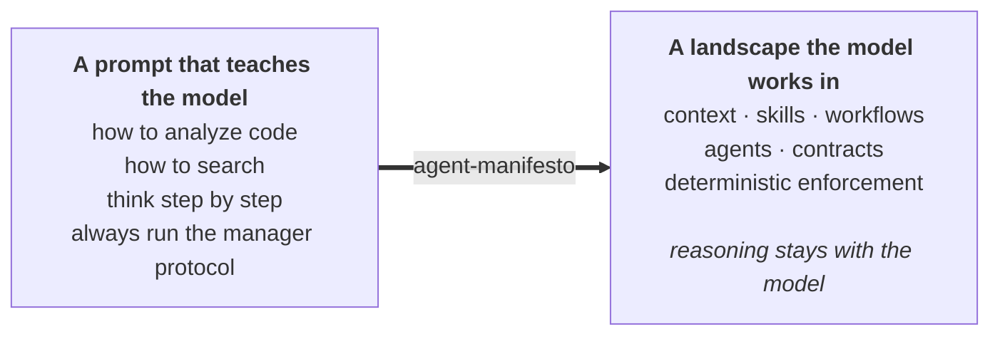

# Agent Manifesto

**A soft harness for capable models.** Models can read code, search, and reason; they cannot know your business,
conventions, or authority boundaries. Agent Manifesto supplies the smallest surrounding system—context, policies,
procedures, and boundaries—for Claude Code, Codex, and other capable agents, maintained by subtraction as well as
addition.



## Contents

- [How to use it](#how-to-use-it) — install, then the five things it does
- [What you get](#what-you-get) — the components and what they cost
- [The idea](#the-idea) — why a landscape instead of a prompt
- [What setup asks you](#what-setup-asks-you)
- [Reference](#reference) — layout, validation, evaluation, local development
- [Migrating from 2.x](#migrating-from-2x)

---

## How to use it

### Install

**Claude Code**

```text
/plugin marketplace add AlexeyPlatkovsky/agent-manifesto
/plugin install agent-manifesto@agent-manifesto
```

**Codex**

```text
codex plugin marketplace add AlexeyPlatkovsky/agent-manifesto
codex plugin add agent-manifesto@agent-manifesto
```

In Codex, you can also browse with `/plugins`. Start a new session before using the plugin.

Or clone the repository without installing; the workflows also work directly from their files.

### Then ask for what you need

Describe the work normally and the `ai-landscape` skill routes it to the right procedure. To choose one directly,
point your tool at its file.

| I want to... | Ask for | Or run |
| --- | --- | --- |
| Set up AI instructions for a project | "set up an AI landscape here" | `workflows/setup.yml` |
| Trim instructions that no longer earn their place | "review this project's AI instructions" | `workflows/review.yml` |
| Add one skill, workflow, agent, or rule | "add a migration-review skill" | `workflows/extend.yml` |
| Adopt an external tool without its demos | "adopt this plugin into the project" | `workflows/adopt-tool.yml` |
| Remove the harness and keep what mattered | "retire this AI landscape" | `workflows/retire.yml` |

Workflow paths are relative to `plugins/agent-manifesto/`; from a clone, run
`@plugins/agent-manifesto/workflows/setup.yml`.

Before changing files, workflows inspect, propose scoped changes, and wait for approval; moves, renames, and deletions
always require explicit approval. Setup asks only material questions and evaluates approved work in fresh context;
review is a post-change or six-month reset that may recommend no change; retirement preserves surviving facts,
policies, and boundaries before deletion.

---

## What you get

Claude Code exposes three skills and one custom agent; Codex exposes the three skills and, when possible, uses a fresh
session for independent evaluation. Full instructions load on invoke. For plugin version 3.0.0, Claude Code reports
about 132 tokens of discovery metadata per session:

| Component | Purpose | Always on | On invoke |
| --- | --- | ---: | ---: |
| `agent-manifesto` | Routes requests to workflows | ~40 | ~890 |
| `brainstorm` | Resolves decisions with meaningful alternatives | ~30 | ~240 |
| `documentation-maintenance` | Aligns docs with completed changes | ~30 | ~260 |
| `instruction-evaluator` (Claude only) | Reviews landscapes read-only against a schema | ~30 | ~680 |

The plugin adds no hooks, MCP servers, or LSP servers. Codex reports when independent evaluation is unavailable.

---

## The idea

Every concern has one natural home. An artifact must not absorb a concern that belongs somewhere else.

| Concern | Home |
| --- | --- |
| Facts and preferences | context |
| Universal authority limits | the root contract |
| Task-scoped policies | skills |
| Procedures and sequence | workflows |
| Fresh-context responsibilities | agents |
| Data shapes | contracts |
| Hard guarantees | deterministic enforcement |
| Reasoning | **the model** |

Test each instruction by asking: *would a better model make this unnecessary?* If yes, it is temporary scaffolding and
needs evidence to stay; if no, it is durable context.

Two consequences: **approved scope is data, not prose**—each file-changing workflow emits an approved
`change-proposal` contract that a script can check against the diff. **Guarantees are mechanical where possible**—the
Claude evaluator is read-only because its tool grant excludes writing, not because a sentence asks it to behave.

Read [MANIFEST.md](plugins/agent-manifesto/MANIFEST.md) for the values and
[IMPLEMENTATION.md](plugins/agent-manifesto/IMPLEMENTATION.md) for the artifact boundaries.

---

## What setup asks you

Only what applies: a software team is not asked about brand voice, nor a writer about test coverage.

- your role, business, audience, and recurring work
- project purpose and authoritative sources
- personal versus team-shared scope
- which AI tools you actually use
- output, voice, and banned language
- preferred methodologies such as SDD or TDD
- testing and quality expectations
- what the AI may never do, or must ask about first

---

## Reference

### Repository layout

The repository is a marketplace for one plugin. Everything shipped lives under `plugins/agent-manifesto/`, so installs
exclude the git history and CI configuration.

```text
.claude-plugin/marketplace.json     Claude Code catalog
.agents/plugins/marketplace.json    Codex catalog
plugins/agent-manifesto/
├── .claude-plugin/plugin.json      Claude Code manifest
├── .codex-plugin/plugin.json       Codex manifest
├── MANIFEST.md                     values and principles
├── IMPLEMENTATION.md               artifact boundaries and composition rules
├── workflows/*.yml                 setup, review, extension, adoption, retirement
├── skills/*/SKILL.md               the agent-manifesto entry policy plus task-scoped policies
├── agents/*.md                     fresh-context responsibility templates
├── contracts/*.schema.json         workflow, proposal, and result shapes
├── scripts/validate.py             deterministic check, for this repo or any landscape
├── tests/                           validator regression tests
└── evals/                          behavioral cases that test whether the framework earns its place
```

`README.md` and `AGENTS.md` remain at the root. `AGENTS.md` only governs repository version bumps; it is neither a
framework source nor copied into generated landscapes.

### Validating a landscape

```text
python3 plugins/agent-manifesto/scripts/validate.py                 # the framework itself
python3 plugins/agent-manifesto/scripts/validate.py path/to/repo    # a generated landscape
python3 .claude/scripts/validate.py . --snapshot                    # before changing a dirty landscape
python3 .claude/scripts/validate.py . --proposal approved-change.json
```

Using only the standard library, the validator checks workflow shape, skill and agent frontmatter, cross-layer
references, and dependency cycles. Setup installs it into generated landscapes, keeping the check with the harness.

`--snapshot` fingerprints pre-existing changes so they are not mistaken for the agent's work. With `--proposal`, the
validator reports out-of-scope changes, drifted baseline files, mismatched authority-sensitive content hashes, and
private paths staged for commit—turning approval into a check rather than a promise.

### Evaluating the framework itself

```text
python3 plugins/agent-manifesto/evals/run.py --list
```

Three fixtures cover a notes repository that should receive almost no landscape, an over-built 2.x landscape that
should be trimmed without losing facts, and a healthy landscape that should remain unchanged. See
[evals/README.md](plugins/agent-manifesto/evals/README.md) for the comparison method and required evidence-backed
behavioral judgments. Missing judgments cannot produce a passing case.

### Testing a local checkout

Both CLIs accept this repository as a marketplace, allowing local installation and inspection without publishing.

```text
# Claude Code — note the trailing slash; a bare "." is rejected
claude plugin marketplace add ./
claude plugin install agent-manifesto@agent-manifesto --scope local -y
claude plugin details agent-manifesto      # component inventory and token cost

# Codex
codex plugin marketplace add .
codex plugin add agent-manifesto@agent-manifesto
codex plugin list
```

`claude plugin details` shows how many skills and agents loaded. Failures appear as zero counts rather than errors, so
inspect the inventory. After editing, run `claude plugin marketplace update agent-manifesto` and reinstall; the
installed copy is a cache, not a link.

Remove plugins before marketplaces to avoid orphaning their caches:

```text
claude plugin uninstall agent-manifesto --scope local
codex plugin remove agent-manifesto@agent-manifesto   # the @marketplace suffix is required

claude plugin marketplace remove agent-manifesto
codex plugin marketplace remove agent-manifesto
```

### When your model or tools change

Start migrations from the smallest prompt that preserves your contract. Retest old instructions: durable context
stays, while scaffolding must keep earning its place.

---

## Migrating from 2.x

Version 3.0 is a breaking simplification:

- numbered Markdown stages become YAML workflows, and pipelines become workflows
- protocol derivation and the generated project-convention layer are removed
- the mandatory manager and task-complete capability are removed
- conversational handoffs become contracts only where structured data is actually needed
- instruction evaluation stays universal; scenario-test machinery is no longer generated by default
- the project profile becomes ordinary context created during setup, not a mandatory preliminary stage
- approved scope becomes a `change-proposal` contract that a script can check against the diff
- retirement becomes a supported workflow instead of an undocumented manual cleanup
- the framework ships as a plugin for the Claude Code and Codex marketplaces

Before migrating, review 2.x landscapes with `@plugins/agent-manifesto/workflows/review.yml`. Moving or deleting
artifacts still requires explicit approval.

---

## License

© Alexey Platkovsky. Licensed under [CC BY 4.0](https://creativecommons.org/licenses/by/4.0/).
